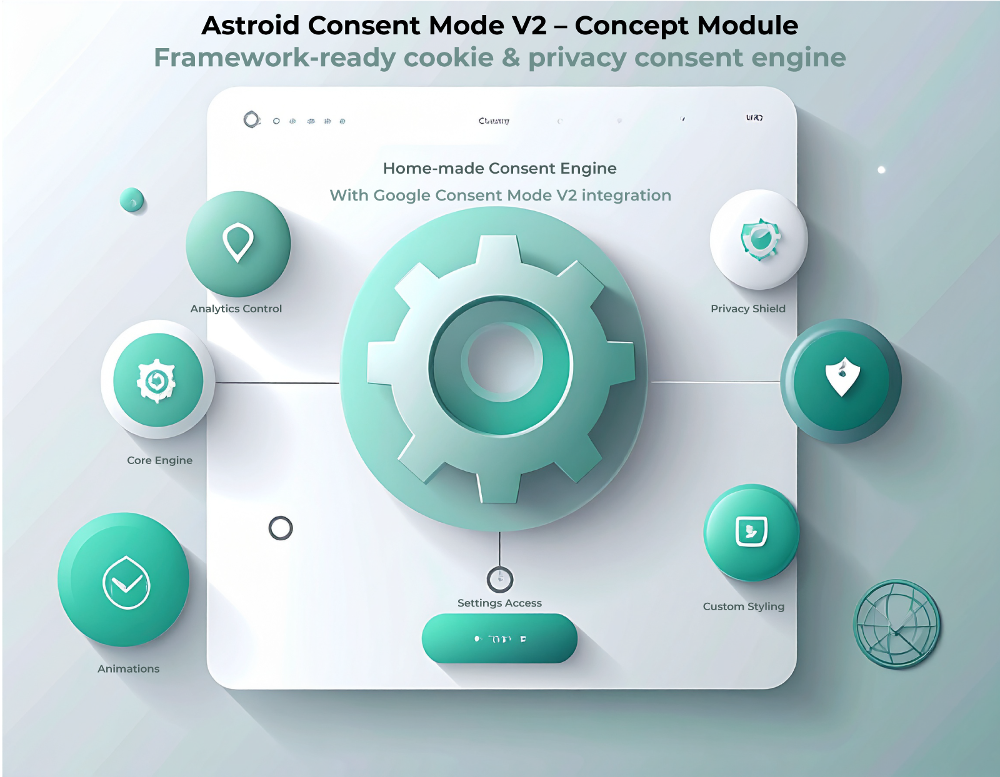

# Astroid Cookie Consent Framework  
A simple, lightweight cookie consent popup for the Astroid Joomla Framework.  
Supports Google Consent Mode v2 and optional GA4 loading.

---



## Features
- Lightweight cookie consent popup  
- Google Consent Mode V2 compatible  
- Optional GA4 auto-loader  
- Fully themeable with CSS variables  
- Works inside Astroid Custom Code (no extensions needed)


---

## How to use
1. Add your config before `</head>`
<!-- Astroid Consent Config -->
<script>
  window.AstroidConsentConfig = {
    ga4: false,                   // Set to true if GA4 should auto-load after consent
    consentCookie: "ac_consent",  // Name of the consent cookie
    consentLifetimeDays: 30,      // Days before the user is asked again
    policyUrl: "/privacy#cookies" // Link to your cookie/policy section
  };
</script>


3. Add the main code before `</body>`
4. ### 3. Add the main code before `</body>`

```html
<!-- Astroid Consent Engine -->
<script>
(function() {

  const cfg = window.AstroidConsentConfig || {};
  const cookieName = cfg.consentCookie || "ac_consent";
  const lifetime = cfg.consentLifetimeDays || 30;

  /* ------------------------------------------------- */
  /* Basic cookie helpers                              */
  /* ------------------------------------------------- */
  function setCookie(name, value, days) {
    const d = new Date();
    d.setTime(d.getTime() + (days * 24 * 60 * 60 * 1000));
    document.cookie = `${name}=${value}; expires=${d.toUTCString()}; path=/`;
  }

  function getCookie(name) {
    return document.cookie
      .split("; ")
      .find(row => row.startsWith(name + "="))
      ?.split("=")[1] || null;
  }

  /* ------------------------------------------------- */
  /* Optional: load GA4 after consent                   */
  /* ------------------------------------------------- */
  function loadGA4() {
    if (!cfg.ga4) return;
    if (document.getElementById("ac-ga4")) return;

    const s = document.createElement("script");
    s.id = "ac-ga4";
    s.async = true;
    s.src = "https://www.googletagmanager.com/gtag/js?id=" + cfg.ga4;
    document.head.appendChild(s);

    s.onload = () => {
      window.dataLayer = window.dataLayer || [];
      function gtag(){ dataLayer.push(arguments); }
      window.gtag = gtag;
      gtag("js", new Date());
      gtag("config", cfg.ga4);
    };
  }

  /* ------------------------------------------------- */
  /* Consent API                                        */
  /* ------------------------------------------------- */
  window.AstroidConsent = {
    allowAll() {
      setCookie(cookieName, "all", lifetime);
      loadGA4();
    },

    denyAll() {
      setCookie(cookieName, "necessary", lifetime);
    },

    getStatus() {
      return getCookie(cookieName);
    }
  };

})();
</script>


That’s it.

---

## Customization
Colors and styling can be adjusted via CSS variables.  
Fully framework-friendly and cleanly separated from Astroid’s core.

---

## License
MIT License.

---

## Author
Henrik Larsen
